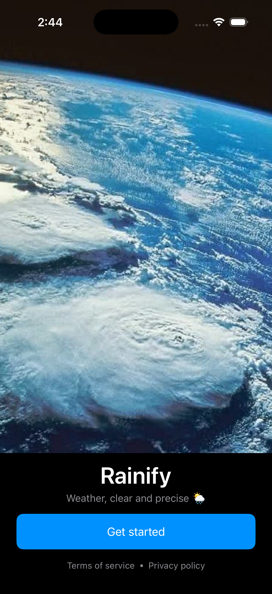
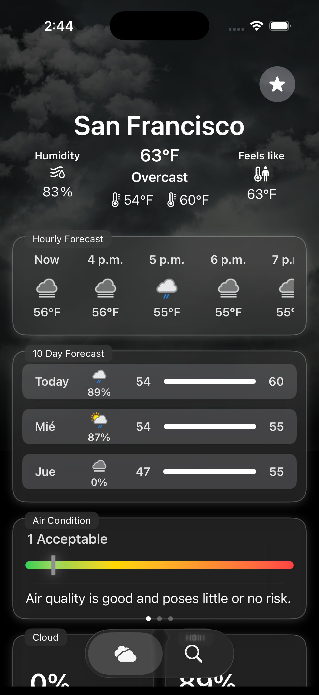
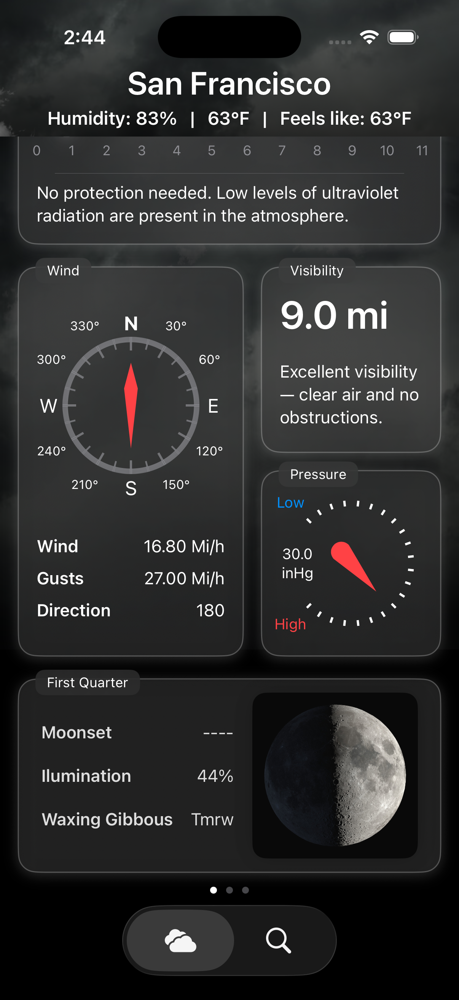
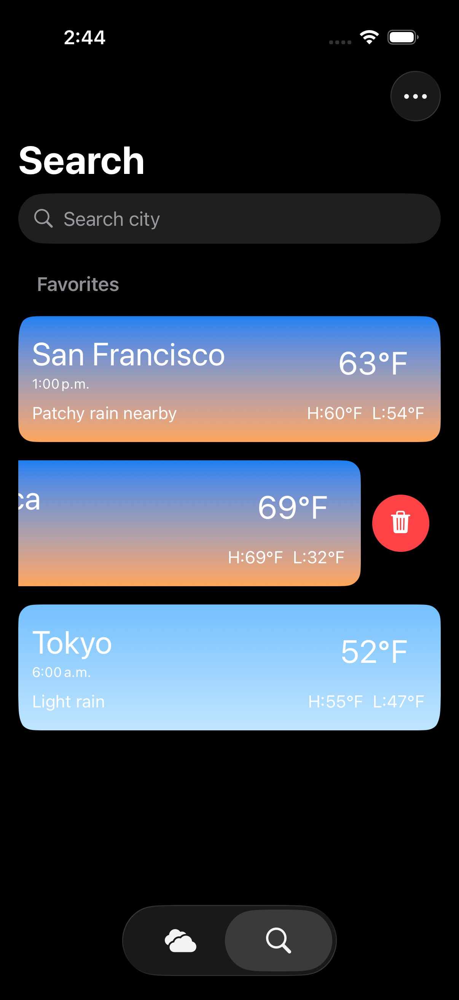
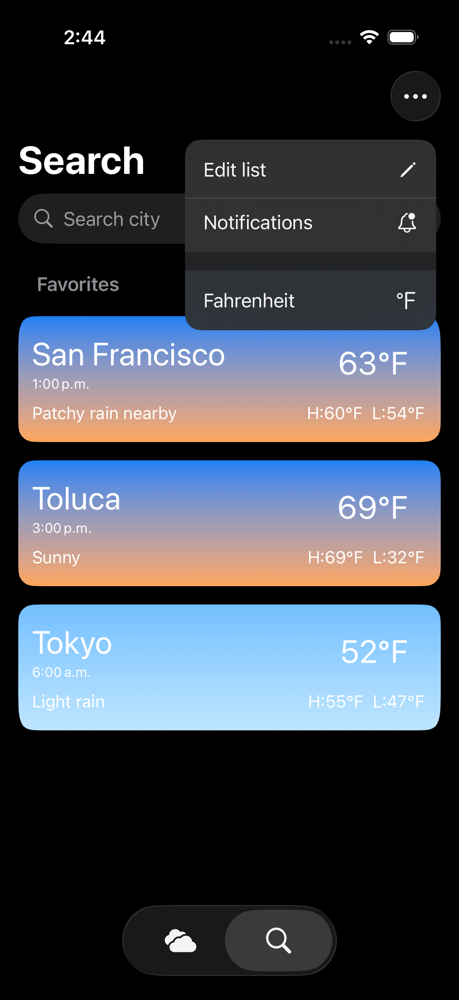
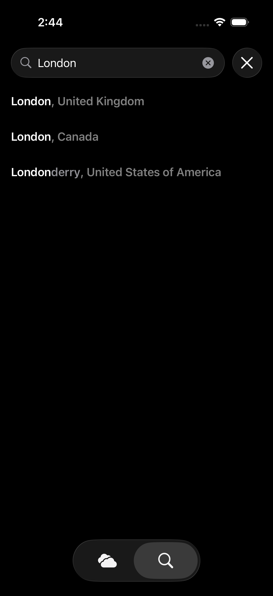
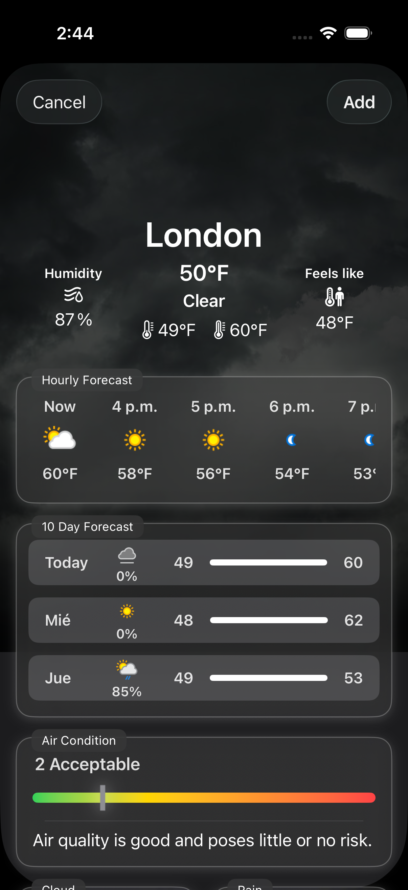

# 🌤 Weather App - SwiftUI

## 📱 About the Project

Weather App is an iOS application built with SwiftUI that displays real-time weather data using a public API.

The app follows the MVVM architecture pattern and focuses on clean UI design and proper data handling.

## 🛠 Tech Stack

- Swift 6
- SwiftUI
- MVVM Architecture
- REST API Integration
- Local Data Persistence 
- Codable
- Protocols
- Async/Await
- CoreLocation
- Dependency Injection 

## ✨ Features

- Real-time weather updates
- 10-day forecast
- Hourly forecast
- Dynamic backgrounds based on weather
- Location search
- Temperature unit selection (Celsius or Fahrenheit)
- Favorites and temperature unit persistence

## 🧠 Architecture

The app follows the MVVM architecture:

- Model Layer: Decodable API models and local persistence entities
- View Layer: SwiftUI Views
- ViewModel Layer: Business logic, state management, and data transformation
- Service Layer: Networking and API abstraction
- Persistence Layer: Local storage management

Dependency injection is used to improve testability.

## 🚀 Getting Started

1. Clone the repository
2. Open the project in Xcode
3. Add your API key in Config.swift
4. Run on iOS Simulator

🔐 Configuration

This project requires a free API key from WeatherAPI.

1. Create a free account at [WeatherAPI](https://www.weatherapi.com/login.aspx)

2. Generate your API key.

3. Create a file named `Config.swift` and add:

struct Config {
    static let apiKey = "YOUR_API_KEY"
}

## 📚 Key Learnings

- Designing scalable MVVM architecture
- Handling asynchronous API calls
- Managing app state efficiently
- Managing local data persistence securely
- Building reusable components

## 📱 Screenshots
### Welcome Screen

  

First screen shown the first time the app launches to request the user’s location and grant access to the application.

### Main Weather Screen

  
  

Main screen displayed when entering the application, where all favorite locations are shown along with their current weather, forecasts, temperatures, air conditions, and UV index.

### Search Screen

    
  

Secondary main view where the user can edit, add, and view all favorite locations, search for new locations, navigate to their weather details by tapping on them, and change the preferred temperature unit.

### Search Suggestion Screen

    
  

Search view for new locations where, after typing more than two letters of a city or location name, suggested results are displayed. Tapping on one of them presents a modal view showing the weather information for that selected location.

## 💡 Why This Project

This project was built to practice scalable SwiftUI architecture,
proper state management, and real-world API integration.
It focuses on clean code principles and reusable components.

